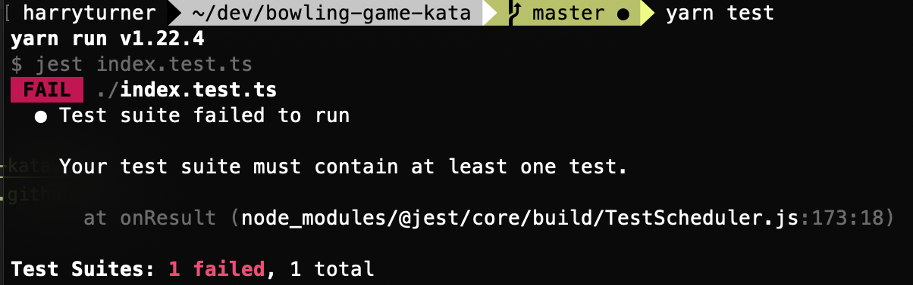

# Kata: Uncle Bobs Bowling game

Kata for Uncle Bobs [bowling game](http://butunclebob.com/ArticleS.UncleBob.TheBowlingGameKata)


### Start

```bash
$ git clone https://github.com/harrymt/bowling-game-kata.git
$ cd bowling-game-kata
$ git checkout -b start-n
```

### Tests

```bash
$ yarn test # or `npm run test`
```



1. Game
2. All ones
3. One Spare
4. One Strike
5. The perfect game

### Example finished Kata

```bash
$ git checkout finished
```
